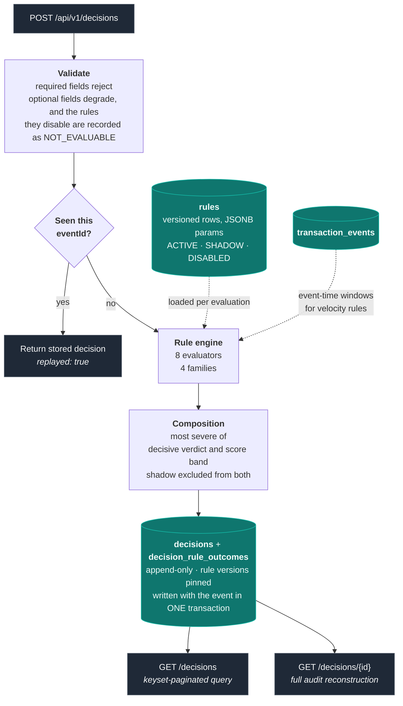

# Fraud Rule Engine

[](https://github.com/katlego95/fraud-rule-engine-service/actions/workflows/ci.yml)

A fraud decision service for card transactions. One categorised transaction in, one explainable verdict out: `APPROVE`, `REVIEW` or `BLOCK`, with every rule that ran, what each contributed, and a sentence a human can read.

Rules live in the database as versioned rows, not in code, so they change without a deployment. Decisions are append-only and pin the exact rule versions that produced them, so a decision made today is still explainable a year from now under the rules as they stood.

`Java 25` · `Spring Boot 4.1` · `PostgreSQL 18` · `Flyway` · `Testcontainers` · 93 tests

---

## Run

```bash
docker compose up --build
```

Ready in about five seconds, with 1,276 seeded legitimate transactions and four labelled fraud scenarios.

> `./mvnw verify` needs a running Docker daemon — integration tests use
> Testcontainers against real PostgreSQL. `./mvnw test` runs the 44 unit
> tests without it.

<details>
<summary>Build, standalone Docker, and tests</summary>

```bash
./mvnw clean package                    # jar
docker build -t fraud-rule-engine .     # image

# The Dockerfile runs independently of compose
docker run --rm -p 8080:8080 \
  -e DATABASE_URL=jdbc:postgresql://host.docker.internal:5432/fraud \
  -e DATABASE_USERNAME=fraud -e DATABASE_PASSWORD=fraud \
  fraud-rule-engine

./mvnw test      # 44 unit tests, no Docker needed
./mvnw verify    # full 93, needs Docker for Testcontainers
```

Without a reachable database the service fails within about fifteen seconds with a readable message, not a stack trace.

</details>

---

## Five minutes to see it work

**1 · Weak signals accumulate into a REVIEW.** No single rule demands it; the score does.

```bash
curl -s -X POST localhost:8080/api/v1/decisions -H 'Content-Type: application/json' -d '{
  "eventId":"22222222-2222-4222-8222-222222222222",
  "occurredAt":"2026-08-03T09:05:00Z","accountId":"acct-walkthrough",
  "cardToken":"4000123499884821","amount":"12000.00","currency":"ZAR",
  "merchantId":"quicksilver-digital","merchantCategoryCode":"7995",
  "merchantCountry":"ZA","channel":"ECOMMERCE","category":"gambling"}' \
  | jq '{verdict, totalScore}'
```

→ `REVIEW`, score 55. Three contributory rules matched (15 + 15 + 25), crossing the review band at 40.

**2 · A velocity rule blocks.** One request cannot trip a velocity rule, so a demo endpoint replays a labelled sequence through the same path the batch endpoint uses.

```bash
curl -s -X POST localhost:8080/api/v1/demo/scenarios/card-testing \
  | jq '{typology, verdicts: [.decisions[].verdict]}'
```

→ Five authorisations in under four minutes on one card. First four approve, fifth blocks. Also `merchant-spread`, `account-takeover`, `geo-impossible`.

**3 · Rules are data.** Disable one, resend the same transaction, get a different verdict. No restart, no deployment.

```bash
RULE_ID=$(curl -s localhost:8080/api/v1/rules | jq -r '.[] | select(.code=="HIGH_AMOUNT") | .id')
curl -s -X PATCH localhost:8080/api/v1/rules/$RULE_ID/mode \
  -H 'Content-Type: application/json' -d '{"mode":"DISABLED"}' | jq '{code, mode}'
```

Resend step 1 with a new `eventId` → score 40 instead of 55. Set the mode to `SHADOW` instead and the rule appears on the decision with its full contribution recorded while changing nothing, which is how a threshold change is observed against live traffic before it blocks anyone.

**4 · The audit view.** Everything needed to explain a decision without consulting a rules table that may have changed since.

```bash
curl -s localhost:8080/api/v1/transactions/22222222-2222-4222-8222-222222222222/decision | jq
```

→ The input as evaluated, every rule that ran (not only those that matched), the version and mode of each, its contribution and reason, both halves of the composition, and the bands in force.

**5 · Idempotency.** Resend any request above with the same `eventId`.

→ `"replayed": true`, same `decisionId`, same `evaluatedAt`. No re-evaluation, no second decision. A different amount under the same `eventId` returns `409`.

The flagged-fraud query the brief asks for: `GET /api/v1/decisions?verdict=BLOCK,REVIEW`, keyset-paginated, filters on `accountId`, `cardToken`, `ruleCode`, `minScore`, `from`, `to`.

---

## The rule set

Ten rules, each mapped to a named fraud typology.

| Rule | Mode | Nature | Effect | Typology |
|---|---|---|---|---|
| `HIGH_AMOUNT` | active | contributory | +15 | General anomaly |
| `HIGH_RISK_MCC` | active | contributory | +15 | Stolen card usage |
| `BLOCKED_COUNTRY` | active | decisive | BLOCK | Sanctions, known-fraud geographies |
| `CNP_HIGH_AMOUNT` | active | contributory | +25 | Card-not-present fraud — e-commerce and transfer |
| `CARD_TXN_VELOCITY` | active | decisive | BLOCK | Card testing |
| `MERCHANT_SPREAD_VELOCITY` | active | contributory | +20 | Card testing across merchants |
| `ACCOUNT_AMOUNT_VELOCITY` | active | decisive | REVIEW | Account takeover, cash-out |
| `GEO_IMPOSSIBLE` | active | decisive | BLOCK | Cloned card, second location |
| `IP_CARD_SPREAD` | **shadow** | contributory | +20 | Card testing from one source |
| `DEVICE_ACCOUNT_SPREAD` | **shadow** | contributory | +25 | Mule networks, account takeover |

The last two ship in shadow: they are evaluated and recorded on every decision but
change no verdict, because nobody has validated their thresholds against real
traffic. `GET /rules/{code}/shadow-report` answers what they would have done. See
[ADR 0008](docs/adr/0008-new-rules-ship-in-shadow.md).

**Hybrid decisioning.** Decisive rules emit a verdict directly; contributory rules add weight to a score. The final verdict is the more severe of the two. Bands: `< 40` approve, `40–69` review, `≥ 70` block. Weights are set so combinations cross the bands meaningfully, and a test asserts that arithmetic so a later change cannot silently flatten them.

**Velocity windows include the transaction being evaluated.** Four in five minutes is within threshold; the fifth blocks. Every velocity rule's description says "including this one", because the convention shifts every threshold by one and the description is what a call centre agent reads.

---

## Architecture



**The event and its decision are written in one transaction.** Split across two, a crash between them leaves an event marked "already seen" with no decision to return. Every retry then takes the replay path, finds nothing, and that identifier is poisoned permanently.

### Storage

| Table | Shape | Why |
|---|---|---|
| `rules` | Versioned by insertion, never mutated. Type-specific config in JSONB | A decision made last Tuesday was made under last Tuesday's rules |
| `transaction_events` | Every evaluated event. Indexed `(card_token, occurred_at DESC)` and `(account_id, occurred_at DESC)` | Doubles as the velocity substrate: three rules query it |
| `decisions` | Append-only. Carries an input snapshot, not just a foreign key | The audit view must stand alone, because the source may have changed |
| `decision_rule_outcomes` | One row per rule *evaluated*, not per rule matched. Pins the rule version that ran | `MATCHED` / `NOT_MATCHED` / `NOT_EVALUABLE` are three different facts, and collapsing them loses the one the audit trail exists to preserve |

**Access layer:** Spring Data JDBC and `JdbcClient` rather than JPA. The access patterns are query-shaped — windowed aggregates, keyset pagination, `ON CONFLICT` — and lazy loading and change tracking add machinery that buys nothing against them.

---

## Design decisions

| Decision | Why | Rejected |
|---|---|---|
| Rules as versioned data, custom evaluator | Eight rules make Rete irrelevant; versioning, shadow mode and replay fall out of a data model for free | Drools. Grab reached the same conclusion building [Griffin](https://engineering.grab.com/griffin) |
| Hybrid: decisive verdicts + weighted score | Pure precedence cannot express "three weak signals together"; pure scoring makes every verdict a question about the weight | Either alone |
| Three verdicts, two thresholds | Blocking a real customer's groceries costs a call centre ticket and possibly the relationship. A false positive is not free | Binary allow/deny |
| Event time, not processing time | Backdated sequences fire correctly, tests are deterministic, out-of-order arrival is handled | Server clock |
| Synchronous, 150ms p99 budget | A decision arriving after authorisation completes is detection, not prevention | Async ingestion, and Kafka with it |
| Idempotency by DB constraint | At-least-once delivery means duplicate blocks and corrupted velocity counts. `ON CONFLICT DO NOTHING`, not check-then-insert | Application-level dedup |
| Append-only decisions, rules versioned by insertion | An editable audit trail is not one. A decision made last Tuesday was made under last Tuesday's rules | Mutable rules |
| Velocity in PostgreSQL | Correct, durable, no extra infrastructure at this scale | Redis. See *next steps* |
| Spring Data JDBC over JPA | Access patterns are query-shaped: windowed aggregates, keyset pagination, `ON CONFLICT` | Hibernate |
| Testcontainers, real PostgreSQL | An in-memory substitute proves the code works somewhere it will never be deployed | H2 |
| Single currency, ZAR | Summing mixed currencies is meaningless; conversion needs an FX source this service should not own | Silent mis-scoring |
| No machine learning | A model cannot explain itself to a regulator, and training on self-generated synthetic data learns only the generator | Isolation forest |

Full records in [`docs/adr/`](docs/adr/) — seven ADRs, each with the alternatives genuinely considered and the costs accepted. Every judgement call, including the wrong ones, is in [`docs/build-log.md`](docs/build-log.md).

---

## Calibration

The generator labels its injected scenarios, so those labels are ground truth and the engine can be measured against them.

**4 of 4 typologies caught by their intended rule, none by an unintended one. False positive rate 0.47%** across 1,276 legitimate transactions.

Two things worth knowing about that number. The first run reported **0.00%**, which looked like a result and was not: the background corpus contained no high-risk categories and capped e-commerce below the card-not-present threshold, so nothing could trip. And `MERCHANT_SPREAD_VELOCITY` is *detected but not acted on*, because it is contributory at weight 20 and lands below the review band. Forcing it to act would have meant abandoning the hybrid model, so the report separates the two.

The corpus is synthetic and deliberately constructed. These numbers demonstrate the calibration method, not production accuracy.

---

## Performance

**Under load: 1,500 requests per second with zero errors**, on a laptop also running the database and the load generator. The stated 150ms p99 budget holds to 100 concurrent callers (128ms) and is gone by 150 (179ms). Past that the service keeps accepting work and simply gets slower, which is why admission control now caps in-flight decisions at 100 and answers 429 beyond it. Method, per-level numbers and a discarded outlier in [`docs/load-test.md`](docs/load-test.md).

The velocity hot path is an index-only scan at **4 buffers, 0.13ms** against 200,000 events. The same query with its index disabled is a sequential scan at **3,435 buffers, 16.9ms** — not survivable at one per velocity rule per transaction under a 150ms budget. `EXPLAIN` output in [`docs/query-plans.md`](docs/query-plans.md).

Amounts are `BigDecimal` end to end and serialise as strings, with `WRITE_BIGDECIMAL_AS_PLAIN` enabled so a large value cannot publish as `"2.5E+3"`. Card tokens mask themselves in both JSON and `toString`, so the decision log line prints one and still cannot leak it.

---

## Research

The rule set targets named fraud typologies rather than invented conditions. Sources consulted during design:

- Grab Engineering, [*Griffin, an anti-fraud risk rule engine*](https://engineering.grab.com/griffin) — build-vs-buy precedent
- Databricks, [*Payment fraud detection*](https://www.databricks.com/blog/payment-fraud-detection) — typologies, and why static thresholds decay
- Databricks, [*Near real-time anomaly detection*](https://www.databricks.com/blog/near-real-time-anomaly-detection-delta-live-tables-and-databricks-machine-learning) — the ML alternative, declined
- PXP, [*Velocity check*](https://www.pxp.io/payments-glossary/velocity-check) — window tuning, multi-identifier monitoring, attempts vs successes
- Chargeback Gurus, [*Velocity checks as a fraud tool*](https://www.chargebackgurus.com/blog/velocity-checks) — tiered response and step-up authentication
- FinLego, [*Fraud and velocity rule design*](https://finlego.com/blog/fraud-and-velocity-rule-design-for-wallet-and-card-platforms) — audit and regulatory obligations
- Red Hat Developer, [*Credit card fraud with Decision Manager 7*](https://developers.redhat.com/blog/2018/07/26/detecting-credit-card-fraud-with-red-hat-decision-manager-7) — what DRL looks like, before declining it
- Shenoy, [*Sparkov card fraud dataset*](https://www.kaggle.com/datasets/kartik2112/fraud-detection) — the input contract's field set is modelled on this schema

No public dataset ships with the project. The best known one, [ULB](https://www.kaggle.com/mlg-ulb/creditcardfraud), anonymises 28 of its 31 features through PCA, and a business rule cannot reference a principal component. [IEEE-CIS](https://www.kaggle.com/competitions/ieee-fraud-detection) is richer but sits behind competition registration, which would mean a reviewer creating an account before this project runs.

---

## Scope

**Out:** transaction categorisation (arrives already categorised, separate bounded context) · authentication (production: mTLS or OAuth2 between internal services, RBAC on rule administration) · multi-currency · PAN handling (tokenisation is upstream; card numbers never enter this service) · machine learning.

**Next, in order:** a backtest endpoint replaying candidate rules against stored history — deferred for time, not unconsidered, since the evaluator is already a pure function of rule, event and history · Redis-backed velocity windows, which buy latency and introduce a cold-start problem where a fresh instance under-detects until the cache refills · asynchronous ingestion · rule authoring for risk analysts, which is the point of rules-as-data · model scores as inputs *to* rules, keeping the decision layer explainable.

---

MIT licensed.
